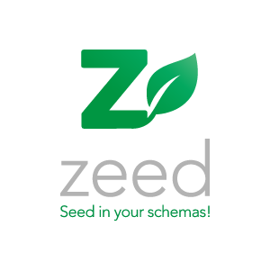

<div align="center">

  

  <h1>zeed: seed in your schemas!</h1>

  <p>
    <strong>The intelligent, type-safe, and relation-aware data generation engine.</strong><br>
    Transform your Zod schemas into realistic data factories ready for your tests or <strong>database seeds</strong>.
  </p>

  <p>
    <a href="https://github.com/oclka/zeed/actions/workflows/ci.yml">
      
    </a>
    <a href="https://sonarcloud.io/summary/new_code?id=oclka_zeed">
      
    </a>
    <a href="https://dashboard.stryker-mutator.io/reports/github.com/oclka/zeed/main">
      
    </a>
    <a href="https://sonarcloud.io/summary/new_code?id=oclka_zeed">
      
    </a>
    <a href="LICENSE">
      
    </a>
  </p>
</div>

---

## 🚀 Why Zeed?

### It's Zimple!

```typescript
export const userSchema = z.object({
  id: z.string().uuid(),

  gender: z
    .enum(['male', 'female'])
    .default('male')
    .meta({
      ratio: { female: 0.7 },
    }),

  firstName: z
    .string()
    .min(2)
    .max(50)
    .meta({
      generator: ({ context }) =>
        context.gender === 'male'
          ? faker.person.firstName('male')
          : faker.person.firstName('female'),
    }),

  email: z
    .string()
    .email()
    .meta({
      generator: ({ context }) =>
        faker.internet.email({
          firstName: context.firstName,
          lastName: context.lastName,
        }),
      unique: true,
    }),
});

// Generate 300 users in DB with consistent data
zeed.generate(userSchema, { count: 300 }).orm({
  type: 'drizzle',
  table: usersTable,
});

// Generate 300 users into a JSON file
zeed.generate(userSchema, { count: 300 }).json({
  file: './seeds/data.json',
});

// Generate 300 users into an HTTP server with full CRUD endpoints
zeed.generate(userSchema, { count: 300 }).http({
  host: 'localhost',
  port: 3000,
});
```

Forget about disconnected seed scripts. With **zeed**, populating your database becomes a natural extension of your schema definition.

By designing your **Zod** contracts, you're already driving the generation. Thanks to **context awareness**, zeed doesn't just fill fields with random noise: it orchestrates coherent data that respects your finest business rules.

---

## ✨ Features

- **🧩 Schema-Aware**: Leverage your existing Zod schemas. No redundancy—your validation rules are your generators.
- **🔄 Relational Integrity**: Automatic dependency resolution (DAG) to create coherent object graphs (e.g., a Post always has a valid Author).
- **⚖️ Ratios & Weights**: Precisely control data distribution (e.g., "generate 10% of users with a premium badge").
- **🧪 Strongly Typed**: High-end Developer Experience (DX) with full type inference for your generated data.
- **⚡ Fluent API**: Intuitive, chainable syntax: `.generate()`, `.json()`, `.orm()`, `.http()`.
- **🌱 Digital Sobriety**: A lightweight, optimized engine with zero unnecessary dependencies in the core.

---

## 📊 Comparison: Why Zeed?

Unlike manual factories or database introspection tools, **zeed** is a consistency engine **centered around your schemas**.

| Criterion               | Factories (Fishery/TS) | Snaplet (Introspection) | **zeed** (Schema-First) |
| :---------------------- | :--------------------: | :---------------------: | :---------------------: |
| **Schema/Seed Sync**    |         Manual         |         Via DB          |       **Native**        |
| **Complex Relations**   |      Custom Code       |       SQL Config        |      **Zod Meta**       |
| **Coherence (Context)** |        Limited         |          High           |       **Maximum**       |
| **Speed (DX)**          |          Slow          |         Medium          |       **Instant**       |
| **Bundle Weight**       |      Lightweight       |          Heavy          |       **Minimal**       |

---

## 📦 Installation

```bash
pnpm add @oclka/zeed
```

---

## 💻 Quick Start

```typescript
import { z } from 'zod';
import { zeed } from '@oclka/zeed';

const userSchema = z.object({
  id: z.string().uuid(),
  email: z.string().email(),
  role: z.enum(['ADMIN', 'USER']),
});

// Instant Generation
const mockUser = zeed.generate(userSchema, { count: 10 });
```

### ORM Injection

```typescript
const results = await zeed
  .generate(userSchema, { count: 10 })
  .orm(db.user.insert); // Direct and typed injection
```

---

## ⚡️ Advanced Features

### Ratio Management

Define precise data distribution via metadata:

```typescript
const schema = z.string().meta({
  ratios: { ACTIVE: 0.8, PENDING: 0.2 },
});
```

### Dependency Resolution

**zeed** iterates through your inter-schema links to ensure that parent entities are created before children (DAG).

---

## 🤝 Contributing

We love contributions! Whether it's a bug fix, documentation improvement, or a new feature request.

1. **Clone the repo**: `git clone https://github.com/oclka/zeed`
2. **Install**: `pnpm install`
3. **Test**: `pnpm test`
4. **Build**: `pnpm build`

---

## 💰 Invest in your productivity

**zeed** saves your team dozens of manual work hours every month. By automating coherent data generation, we eliminate one of the biggest bottlenecks in the development cycle.

### Why become a sponsor?

- **🚀 Immediate ROI**: The cost of sponsorship is negligible compared to the developer time saved on manual seed scripts.
- **🛡️ Sustainability**: Ensure the tool your testing relies on stays maintained, secure, and performant for the long term.
- **🎯 Roadmap Priority**: Sponsors get a prioritized voice in influencing the development of future parsers and plugins.
- **🌍 Visibility**: Show off your logo here and demonstrate your commitment to high-quality developer tooling.

<div align="center">

<p>
  <a href="https://github.com/sponsors/oclka">
    
  </a>
  <a href="https://www.buymeacoffee.com/oclka">
    
  </a>
</p>

[**Discover all sponsorship tiers on GitHub ➔**](https://github.com/sponsors/oclka)

</div>

---

<div align="center">
  <sub>
    <a href="LICENSE">
      
    </a>
    <a href="https://github.com/oclka/atomic-config/issues">
      
    </a>
  </sub><br>
  <sub>Made with ❤️ &amp; 🧠 by <a href="https://oclka.dev">OCLKA</a></sub>
</div>
